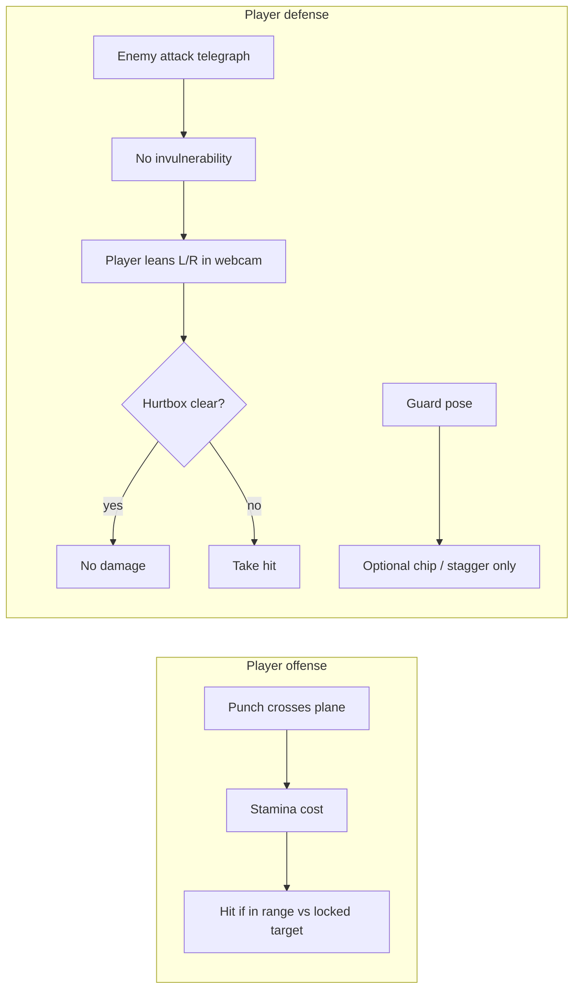
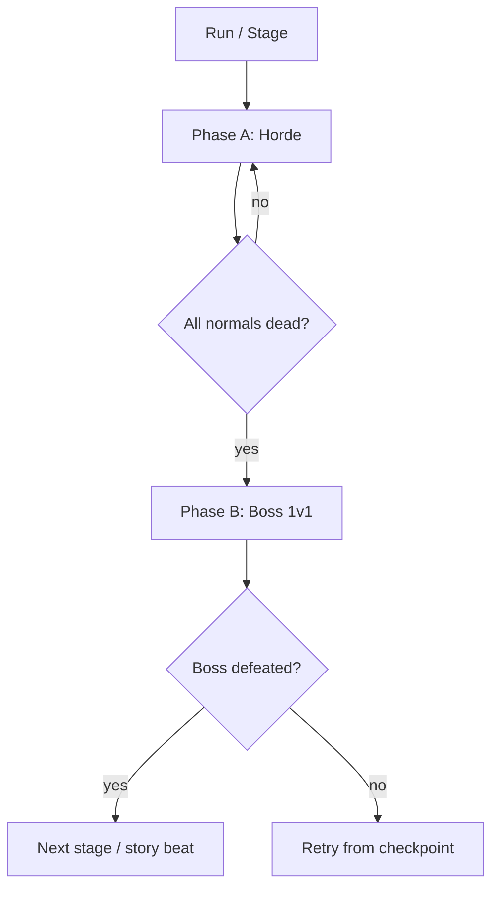

# Webcam Brawler — Gameplay & Story Plan

## What you already have ([boxing_demo](boxing_demo))

The demo is a **pose-input prototype**, not a full game yet:


| System                     | Status in code                                                                                                                                                                                   |
| -------------------------- | ------------------------------------------------------------------------------------------------------------------------------------------------------------------------------------------------ |
| Stamina on offensive cross | **Done** — `[detectStaminaPlaneCross](boxing_demo/boxing.js)` fires when wrist/ankle depth crosses `body + planeOffset`; costs punch / charge / kick in `[boxing.html](boxing_demo/boxing.html)` |
| Defensive verbs            | **Done** — guard, dodge left/right/back via `[classifyBoxingAction](boxing_demo/boxing.js)`                                                                                                      |
| Movement                   | **Partial** — `charPos.x` / `charPos.z` from shoulder lean (`[computeCharPosition](boxing_demo/boxing.html)`); free orbit camera, no enemy                                                       |
| Enemies / lock-on          | **Not started**                                                                                                                                                                                  |


Your choices extend this into a **target-locked action brawler** (Souls-like structure, webcam body as controller).

---

## Core combat rules (your spec)




### 1. Stamina on every punch through the plane

- **Keep** the existing plane-cross model (`[detectStaminaPlaneCross](boxing_demo/boxing.js)`); it is already the right abstraction for “real” reach into the fight space.
- **Rule:** any successful cross costs stamina (jab / charge / kick as today). Empty stamina = weak hits or no hit registration (design choice at implementation time).
- **Regen:** only when not attacking (current regen per frame is fine as a starting point).

### 2. Dodge = positioning, not i-frames

- **No invulnerability window** when `dodge_left` / `dodge_right` is detected.
- **Hit resolution:** compare enemy attack **hurtbox** (lane: left / center / right relative to locked target) vs player **hurtbox** derived from pose + `charPos.x` strafe offset.
- **Player must actually move** (webcam lean / step) so their avatar’s lane does not overlap the attack lane during the active frames of the swing.
- `**dodge_back`:** optional — either remove from MVP, or treat as **spacing** (pull hurtbox back on Z) without granting i-frames; not a substitute for side dodges on wide attacks.

### 3. Forced target lock + strafe-only movement

- **Lock-on:** camera and input frame always face the current target; player cannot freely walk away in “forward” as primary navigation.
- **Strafe:** `charPos.x` (side lean / step) moves the avatar on a **circle or line** around the locked enemy; forward/back (`charPos.z`) is minimal — only small in/out for range tuning if needed.
- **Map pose → game space:**
  - Lateral dodge detection → strafe delta on X (already mirrored correctly in `[detectDirectionalDodge](boxing_demo/boxing.js)`).
  - Disable or heavily clamp free forward movement from hip depth so players cannot “run” off the arena.
- **Attacks:** punches/kicks still use the forward plane relative to **body depth** (already body-anchored in `detectRelativePlaneCross`).

---

## Two-part level structure




### Phase A — Horde (many normal enemies)

- **Goal:** survive waves; manage stamina across multiple targets.
- **Lock behavior:** soft lock — auto-pick nearest threat in front arc; quick switch on kill or manual snap (implementation detail).
- **Enemy design:** low HP, simple telegraphs (straight / hook from one lane), punish greedy punching into stamina debt.
- **Why it fits webcam:** shorter fights, forgiving timing, teaches “dodge with your body, don’t button-mash.”

### Phase B — Boss (1v1)

- **Goal:** read patterns; stamina and guard economy matter.
- **Lock behavior:** **hard lock** — single target, arena boundary, boss occupies center.
- **Boss design:** multi-phase patterns, lane sweeps, feints; optional use of `dodge_back` only for specific “lunging” attacks.
- **Why it fits:** matches `[z_plan.md](boxing_demo/z_plan.md)` “Souls-like” boss fantasy and accurate Z for punch reach.

---

## Story scope for solo dev / 1 year / ~300 THB

**Commercial reality:** ~300 THB (~$8–10 USD) buyers expect a **tight, complete loop** (roughly **2–4 hours** first clear), not a 20-hour RPG. Story should **explain the webcam** and **structure stages**, not carry heavy cutscenes.

**Solo-friendly story budget:**

| Ship | Skip (for v1) |
|------|----------------|
| 6–8 linear stages (horde → boss each) | Branching endings |
| 1-screen intro + 1-line phase transitions | Full voice acting |
| Boss name card + 2–3 sentences | Motion comic cutscenes |
| Text in **Thai + English** (Steam page audience) | Multiple playable characters |
| Reuse arenas with lighting/palette swaps | Unique city for every stage |

**Recommended structure:** each stage = **one paragraph of lore** + **one boss identity**. Player motivation stays constant; bosses carry the personality.

---

## Story options (pick one spine)

### Option A — **Echo Gym** (recommended for your market + scope)

**Title (working):** *Echo Gym* / *ยิมเงา* (Thai subtitle on store page)

**Premise:** An old Bangkok basement gym closed after a fire. A cheap “mirror training” app lets people spar again — but the reflections **fight back**. Waves are **copy-paste echoes** of past students; each boss is someone who **never left** the ring.

**Why it fits 300 THB + Thailand:**

- Local flavor without expensive world-building (one gym, many nights).
- Webcam = “you signed the waiver; the mirror reads your body.”
- Horde = crowd of echoes; boss = named student with a grudge.
- Emotional hook is simple: **clear the gym so it can reopen** (or so you can stop seeing them).

**6-stage arc (example):**

1. **Open mat** — tutorial echoes; boss: cocky kid who copies your rhythm.
2. **Debt night** — boss: promoter’s enforcer (teaches lane sweeps).
3. **Old timer** — boss: retired coach echo (feint patterns).
4. **Sister’s bout** — boss: family tie (emotional beat, still 1v1).
5. **Fire memory** — boss: silhouette from the night of the fire (hard patterns).
6. **The mirror** — final boss: **your own echo** (reads aggressive play; punishes stamina spam).

**Ending (one line):** Gym lights turn on; mirror cracks. Credits: “You still train here — but now you’re the real one.”

---

### Option B — **Trial Link** (sci-fi, very cheap assets)

**Premise:** Prisoners fight in a **sync arena** to shorten sentences. Webcam is court-mandated body tracking. Waves = other inmates; bosses = wardens’ champions.

**Pros:** Explains lock-on arena, no escape, gritty tone. **Cons:** Less distinctive on Steam; harder to feel “personal” at 300 THB without strong writing.

---

### Option C — **Last Broadcast** (arcade / playful)

**Premise:** You’re the sole contestant on a dying fight stream. Chat spawns horde enemies; subscriber boss fights at milestones.

**Pros:** Funny VO lines optional later; meta fit for streamers. **Cons:** Tone clashes with no-i-frame hard combat unless you lean dark comedy.

---

## Primary recommendation: **Echo Gym**

Best balance of **mechanic lore**, **solo asset reuse**, and **Thai market identity** without needing a huge script.

**Mechanic ↔ story mapping:**

| Gameplay | Story line (one UI string) |
|----------|----------------------------|
| Stamina on plane cross | “The mirror taxes every real hit.” |
| No i-frame dodge | “Reflections don’t miss — move.” |
| Target lock + strafe | “The mat only has one center — circle it.” |
| Horde phase | “Echo density rising.” |
| Boss phase | “Anchor formed — name appears.” |

**Tone:** gritty-heroic (serious gym, hopeful ending). Not horror, not parody.

**Store pitch (one sentence):** *Use your webcam to fight your reflection in a haunted Bangkok gym — survive the echo waves, then face the fighters who never walked out.*

---

## What to write in year 1 (story production checklist)

1. **400–600 words total** — intro, 6 boss intros, 6 clear lines, ending (can draft in a spreadsheet).
2. **UI only** — black cards, white text, gym photo background (blurred).
3. **Boss tells** — one gameplay hint baked into intro (*“She always feints left before the hook.”*).
4. **Localization** — Thai first if primary market is Thailand; English for Steam global.
5. **No story-dependent mechanics** — all stages use same combat; bosses differ by patterns only.

---

## Example scenes, enemies & bosses (Echo Gym)

### Shared arena layout (one 3D gym, reskinned per stage)

```
        [Mirror wall — boss spawns here]
              |
    L-lane    |    R-lane
         \    |    /
          \   |   /
           [BOSS / PLAYER orbit]
          /   |   \
         /    |    \
    [Horde spawn arc: 3 slots L / C / R]
```

- **Player:** always on a **strafe ring** around lock target (no free roam).
- **Lanes:** `left` | `center` | `right` relative to camera-facing enemy.
- **Telegraph UI:** floor stripe color (red = active soon, white flash = swing now).
- **Reuse:** same boxing ring mesh; change **light color**, **fog**, **poster textures**, **mirror crack VFX**.

---

### Horde enemy archetypes (4 types, palette-swap per stage)

| ID | Name | Look | Behavior | Teaches |
|----|------|------|----------|---------|
| **E1 Drifter** | Faded echo, translucent | Slow jab from **center**; long telegraph | Read telegraph, first punches |
| **E2 Rusher** | Tighter glow, forward lean | Fast straight from **center**; low HP | Don’t stand in center |
| **E3 Hooker** | Bent arm silhouette | Hook from **left OR right** lane only | Side dodge (webcam lean) |
| **E4 Grappler** | Hunched, wide shoulders | Double-tap: feint center → real **hook right** | Don’t dodge on feint |

**Horde rules:**

- Max **3 echoes alive** (performance + readability).
- Soft lock: nearest attacker in front 120° arc.
- **No i-frames:** dodge = your strafe lane ≠ attack lane during active frames.
- Echoes **don’t use kicks** (keeps stamina teaching on player only).

---

### Stage-by-stage: scene + waves + boss

#### Stage 1 — **Open Mat** (tutorial)

**Scene:** Fluorescent lights, clean mirror, morning palette. Poster: gym rules.

**Horde (2 waves):**

- Wave 1: 3× E1 Drifter (one at a time from center).
- Wave 2: 2× E1 + 1× E2 Rusher.

**Transition line:** *“Echo density stable… anchor forming.”*

**Boss: Nong Film** — *The Copycat*

| | Design |
|---|--------|
| **Look** | Young fighter, gym shorts, mirror-trail afterimage on every punch |
| **Fantasy** | Copies your rhythm — punishes button-mashing |
| **HP** | Low (~60s fight) |
| **Phase 1** | Alternates jab / jab; every 3rd attack is **delayed** (feint timing) |
| **Phase 2** (50% HP) | Adds **mirror hook** — telegraphs left, hits right (one clear tell) |
| **Tell** | Shoulder dips **opposite** to real strike |
| **Intro card** | *“He learned by watching. Don’t show him the same move twice.”* |

---

#### Stage 2 — **Debt Night**

**Scene:** Dim amber bulbs, debt ledger chalkboard, fan shadow. Mirror slightly cracked.

**Horde:**

- Wave 1: 2× E2 + 1× E3.
- Wave 2: 1× E3 left + 1× E3 right + 1× E4 (teach feint).

**Boss: Sombat “Ledger”** — *The Enforcer*

| | Design |
|---|--------|
| **Look** | Broad, tape on hands, promoter armband echo |
| **Fantasy** | Lane control — owns center, sweeps sides |
| **Phase 1** | **Center body blow** (must strafe off center) |
| **Phase 2** | **Lane sweep**: wind-up center → hits **left + right** in sequence (dodge one, block/guard chip other OR strafe twice) |
| **Phase 3** (30% HP) | **Overhand** from center — only safe in **left or right** lane at max range |
| **Tell** | Cracks knuckles on **same side** as sweep |
| **Intro** | *“He collects in the ring. Center is his — step off the line.”* |

---

#### Stage 3 — **Old Timer**

**Scene:** Blue-hour lighting, old photos on wall, worn heavy bag. Dust particles.

**Horde:**

- Wave 1: 3× E3 (alternating lanes).
- Wave 2: 2× E4 + 1× E2.

**Boss: Coach Piak** — *The Feinter*

| | Design |
|---|--------|
| **Look** | Older, relaxed guard, towel on neck |
| **Fantasy** | Teaches patience — false highs, real low hooks |
| **Pattern A** | High feint (no damage) → low hook **same side** |
| **Pattern B** | Step back (`dodge_back` visual) → **lunge jab center** (must strafe, not back) |
| **Phase 2** | Double feint → **uppercut center** (guard mitigates chip) |
| **Tell** | Exhales audibly only on **real** hit |
| **Intro** | *“He won’t hurt you on the feint. Wait for the breath.”* |

---

#### Stage 4 — **Sister’s Bout**

**Scene:** Single pink glove on hook, family photo blurred. Neutral lighting, emotional quiet.

**Horde:**

- Wave 1: Fast respawn E2 (pressure — “crowd chanting” SFX only).
- Wave 2: E3 + E3 + E4 mix.

**Boss: Lin** — *The Swarm*

| | Design |
|---|--------|
| **Look** | Fighter with long braid echo, quicker footwork |
| **Fantasy** | Rapid **left-right-left** jabs — stamina check on player |
| **Phase 1** | Alternating **L / R** jabs (must physically dodge each) |
| **Phase 2** | Pause → **burst 3-hit** same lane (guard or hard strafe) |
| **Phase 3** | Calls 2× E1 Drifter shadows (10s) while she **charges** center — kill shadows or eat hit |
| **Tell** | Braid sways toward **first** real strike side |
| **Intro** | *“She never stops moving. Pick a lane and commit.”* |

---

#### Stage 5 — **Fire Memory**

**Scene:** Orange rim light, smoke haze, charred corner poster. Mirror **shattered** (boss in broken reflection).

**Horde:**

- Wave 1: 2× E4 + 2× E2 (aggressive).
- Wave 2: All four archetypes, 5 total spawns over 90s.

**Boss: The Silhouette** — *Ash Walker*

| | Design |
|---|--------|
| **Look** | No face, ember edges, smoke trail |
| **Fantasy** | Wide attacks — tests L/R dodge under stress |
| **Attack 1** | **Fireline hook** — fills **left→right** over 1s (must be in opposite lane before active) |
| **Attack 2** | **Ember jab** center ×2 then **cross right** |
| **Phase 2** | Arena **narrows** (visual only: fire on lane edges) — wrong lane = chip damage standing near edge |
| **Tell** | Ember gathers on **strike side** shoulder |
| **Intro** | *“You don’t know their name. You know the night.”* |

---

#### Stage 6 — **The Mirror** (finale)

**Scene:** Full lights flicker, perfect mirror, player silhouette visible in glass. All prior posters peel away.

**Horde:** **None** — straight to boss (or optional 30s “echo storm” if player needs warmup).

**Boss: Your Echo** — *The Real One*

| | Design |
|---|--------|
| **Look** | Silhouette copy of player skeleton tint (cyan/red trails) |
| **Fantasy** | Punishes **stamina spam** and repeated dodge habits |
| **AI read** | If player punched 3× in 5s → echo **guards** and counters same lane |
| **Pattern** | Copies last player punch lane with **delayed counter** |
| **Phase 2** | **Plane storm**: 3 fast center threats — only **guard** or **perfect strafe** works |
| **Phase 3** | Mirror **shatters** — echo splits: **L echo + R echo** (10 HP each) must kill both before main body recovers |
| **Win** | Mirror cracks, gym lights hold steady, credits |
| **Intro** | *“The waiver said the mirror reads your body. It learned everything.”* |

---

### Attack data template (for implementation)

Each enemy attack is a row, not bespoke code:

```js
{
  id: 'hook_left',
  telegraphMs: 600,
  activeMs: 120,
  lane: 'left',        // left | center | right | sweep_LR
  damage: 12,
  blockable: true,
  dodgeBackHelps: false
}
```

**Boss = ordered list of patterns** (arrays of attack ids + phase thresholds).

---

### Visual / audio budget (solo-friendly)

| Asset | Count |
|-------|-------|
| Echo body mesh | 1 rig, 4 material tints |
| Boss unique silhouette | 6 (can be material + hat/prop on same rig) |
| Arena | 1 room, 6 lighting presets |
| SFX | punch, whoosh, bell, echo glitch, fire crackle |
| Music | 1 loop + 1 boss intensity layer |

---

## Implementation roadmap (when you exit plan mode)

High-level order; each step should extend `[boxing.js](boxing_demo/boxing.js)` + tests in `[boxing.test.mjs](boxing_demo/boxing.test.mjs)`:

1. **Combat core module** — `GameState`: locked target, player hurtbox lane, stamina, no dodge i-frames.
2. **Enemy stub** — telegraphed attacks with lane + active frames; hit test vs player strafe position (not dodge flag alone).
3. **Strafe controller** — clamp movement to lock-on tangent; wire `charPos.x` from dodge/lean only.
4. **Phase A spawner** — wave config (count, types, spawn points in arc around player).
5. **Phase B boss** — state machine (idle → telegraph → active → recover → phase 2).
6. **UI** — lock reticle, stamina, phase banner (“Wave” / “Boss”), telegraph warnings.
7. **Story shell** — intro text, boss name card, stage clear (minimal UI first).

**Explicit non-goals for MVP:** i-frame dodge, free roam, manual camera without lock, online multiplayer.

---

## Open decisions (small, can default later)


| Topic                | Suggested default                                                        |
| -------------------- | ------------------------------------------------------------------------ |
| `dodge_back` in MVP  | Keep for boss range tools only; horde attacks primarily L/R              |
| Guard                | Blocks chip damage or reduces stamina drain; does not replace side dodge |
| Kicks in horde phase | Allowed but expensive (already 32 stamina) — encourages punch discipline |
| Genre label          | “Webcam action brawler” publicly; boxing gestures under the hood         |


