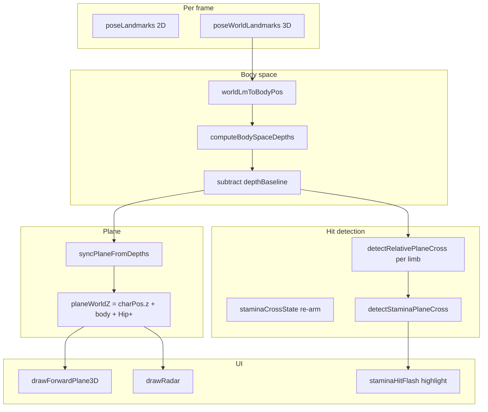

# Boxing Demo — AI Handoff Document

**Project path:** `C:\Users\patch\Documents\Work\boxing_demo`  
**Last updated:** 2026-05-16  
**User symptom:** Stamina feels delayed; only 1–2 punches register per combo. Red plane in 3D does not match when hits feel like they should fire. User reported the latest fix felt **worse** than before.

---

## 1. What this project is

A browser-only **boxing gesture demo** (no Unreal export yet) that:

- Streams webcam through **MediaPipe Pose** (33 landmarks, no hand model).
- Classifies **four defensive actions:** `guard`, `dodge_left`, `dodge_right`, `dodge_back`.
- Uses a **forward stamina plane** in front of the hips: when a wrist or ankle crosses that plane toward the camera, stamina decreases (punch / charge punch / kick costs).
- Renders a **2D webcam overlay**, **3D stick figure**, **top-down radar**, and **red vertical plane** in the 3D panel.

### Core files


| File              | Role                                                      |
| ----------------- | --------------------------------------------------------- |
| `boxing.html`     | UI, MediaPipe loop, 3D draw, stamina loop, debug panel    |
| `boxing.js`       | Pure detectors + depth/plane math (Node-testable, no DOM) |
| `boxing.test.mjs` | Unit tests (`npm test`)                                   |
| `package.json`    | `"test": "node --test boxing.test.mjs"`                   |
| `z_plan.md`       | Notes on hybrid depth strategies (not fully implemented)  |


**Entry point:** Open `boxing.html` in a browser (local file or static server). Click **Start Camera**.

**Related repo context:** Parent folder `C:\Users\patch\Documents\Work\sonnet` has `mediapipe-ue.html` / `SUMMARY.md` for coordinate conventions and FK patterns. This boxing demo reuses similar body-space mirroring (`x: -p.x`, `y: -p.y`, `z: -p.z` in `worldLmToBodyPos`).

---

## 2. The problem (what the user wants fixed)

### Reported behaviour

1. **Delay:** When punching at the webcam, stamina drops noticeably **after** the arm extension, not when the fist visually reaches the red wall.
2. **Low hit count:** Rapid jabs only register **one or two** stamina events per burst, not one per extension.
3. **Plane mismatch:** In 3D, the skeleton often stays **behind** the red plane while punching; the HUD `fwd` value and plane label (`HIP +0.XXm`) do not intuitively match arm reach.
4. **False dodge_back:** Screen recording (`C:\Users\patch\Videos\Screen Recordings\Screen Recording 2026-05-16 172305.mp4`, ~80s) showed **DODGE BACK** stuck on for most of the session while standing still (counter climbed to 9–11).

### Success criteria (from product discussion)

- **What you see = what gets measured:** When the wrist visually crosses the red wall in 3D, stamina should drop on that extension.
- **Combos:** Alternating left/right jabs should each be able to cost stamina after a short retraction.
- **Single coordinate system** for plane drawing and hit detection.
- Optional: highlight which limb crossed (wrist = punch, ankle = kick) — partially implemented via `staminaHitFlash`.

---

## 3. Root cause analysis (read this first)

There are **three different “depth” concepts** in the codebase. Mixing them caused regressions.

### A. Character position `charPos` (body space — current)

From **`poseWorldLandmarks`** after `worldLmToBodyPos` (same negated frame as the 3D skeleton). Hip midpoint minus a **12-frame standing baseline** (`captureCharBaseline` / `charBaseline`), parallel to depth calibration:

```text
midHip.x = (L_hip.x + R_hip.x) / 2
midHip.z = (L_hip.z + R_hip.z) / 2
charPos.x = midHip.x - baseline.hipX
charPos.z = midHip.z - baseline.hipZ
charPos.y = 0
```

Smoothed in `boxing.html` with `CHAR_SMOOTH` and `posMultiplier`. Used for: orbit pivot, floor grid scroll, radar dot, 3D projection offset, and `planeWorldZ` (with `planeBaseZ`).

**No longer used:** normalised-image `-(midHipX - 0.5) * 1.8` or shoulder-width `charPos.z` proxy.

### B. Foreshortening depths `computeForwardDepths(lm, forwardRefs)` (2D proxy)

From **2D segment lengths** vs calibrated refs at camera start:

- **Body:** `forwardDepthFromRatio(shW, refs.shW)` → `(shW/refs - 1) * 0.9` (positive when closer).
- **Limbs:** `forwardDepthFromForeshortening(apparent, ref)` → `(ref/apparent - 1) * 0.9` (positive when segment looks shorter = more forward).

Used for: `detectStaminaPlaneCross`, per-limb re-arm.

**Critical bug (fixed then superseded):** Body used `(refs/shW - 1)` while `charPos.z` used `(shW/refs - 1)` — **opposite sign**. UI plane was drawn from `charPos.z + offset` but hits tested `body + offset` in foreshortening space. That is why the recording showed the character behind the wall while stamina only fired on huge extensions.

### C. MediaPipe world Z in body space (current intended fix)

`worldLmToBodyPos(liveWorldLm)` converts pose world landmarks to body space (metres, hip-relative layout).

**Current stamina path** (`computeBodySpaceDepths` in `boxing.js`):

```text
hipZ = average(lHip.z, rHip.z)
body = shoulderMidZ - hipZ
lw   = leftWrist.z - hipZ
...
```

Depths are **zeroed** against a **12-frame standing baseline** (`captureDepthBaseline` / `depthBaseline`).

**Plane for drawing:**

```text
planeBaseZ  = smoothedDepths.body (after depth baseline subtraction)
planeWorldZ = charPos.z + planeBaseZ + forwardPlaneOffset + wristBase
```

`charPos.z` = whole-body hip forward/back; `planeBaseZ` = torso lean relative to hips (stamina detection space).

3D wall uses `projectWorld({ z: planeWorldZ })`. Skeleton joints use `project({ z: joint.z + charPos.z })` where `project` does `lz = wz - charPos.z`.

**Remaining risks for the next agent:**

1. **Calibration window:** No stamina events until `depthBaseline` is ready (~12 frames, ~0.4s). User must stand still at start.
2. **Bio Z toggle:** `applyBiomechDepth` can modify wrist/ankle Z for display only — stamina uses raw `bodyPosRaw` before bio; if mis-wired, visuals and hits diverge again.
3. **MediaPipe world Z noise / scale:** World landmark Z can be jittery; smoothing may still feel laggy (`CHAR_SMOOTH = 0.10`).
4. **Re-arm logic:** Limb must drop below `plane - STAMINA_REARM_MARGIN` (0.05m) before another hit; partial retracts may block combos.
5. **User said latest build felt worse** — world-Z approach may still not align with perceived punch in selfie view; verify on real camera, use debug panel (key **D**).

---

## 4. Architecture (stamina + plane)




### Stamina event priority (on plane cross)

1. Kick (ankle channels `la` / `ra`)
2. Charge punch (wrist + wind-up ≥ `CHARGE_WINDUP_MIN_FRAMES` on that arm)
3. Normal punch (wrist)

Costs: punch −12, charge −24, kick −32. Regen +0.35/frame. Global cooldown `STAMINA_PLANE_COOLDOWN = 5` frames after any hit.

### Per-limb re-arm

`staminaCrossState = { lw, rw, la, ra }` booleans. After a hit, channel set `false`. Re-armed when `limbDepth < (body + offset - STAMINA_REARM_MARGIN)` via `updateStaminaCrossArming`.

### Dodge back (separate issue)

`detectDirectionalDodge` uses calibrated `forwardRefs.shW` and `shoulderWidthHist`: dodge back only if width < 88% of ref **and** recent max width was ≥ 92% of ref and > 3% wider than current (temporal shrink). Wired via `dodgeDetectOpts(lm)` into `classifyBoxingAction`.

---

## 5. Timeline of changes (why it got worse)


| Stage              | What changed                                                                            | User impact                                                                                                     |
| ------------------ | --------------------------------------------------------------------------------------- | --------------------------------------------------------------------------------------------------------------- |
| Original           | Fixed world plane `forwardPlaneZ`; 2D foreshortening for hits                           | Delayed hits; plane far from body in recording                                                                  |
| Hip-relative plan  | Plane follows `body + offset` from foreshortening                                       | Intended fix                                                                                                    |
| Sign “unification” | `forwardDepthFromRatio` for body to match old `charPos.z` formula                       | UI and detection both in foreshortening space but **still not 3D world Z** — skeleton and wall still misaligned |
| Tuning             | Cooldown 6→3, Hip+ 0.20→0.14, re-arm 0.05→0.03                                          | Still worse per user                                                                                            |
| World-Z fix        | `computeBodySpaceDepths` + 12-frame baseline; `planeWorldZ = charPos.z + body + offset` | Theoretically correct; **user has not confirmed improvement**                                                   |


**Lesson for next agent:** Unifying formulas in 2D proxy space is **not** the same as unifying with the 3D skeleton. Either drive **both** from world landmark Z (current approach) or drive **both** from foreshortening and **stop** drawing the plane in world Z without converting.

---

## 6. Key code locations

### `boxing.js`


| Symbol                                                                  | Purpose                                                                       |
| ----------------------------------------------------------------------- | ----------------------------------------------------------------------------- |
| `computeForwardDepths(lm, refs)`                                        | Legacy 2D foreshortening depths (still exported, used for dodge refs capture) |
| `computeBodySpaceDepths(bodyPos)`                                       | **Current** hip-relative world Z depths                                       |
| `subtractForwardDepths`, `captureDepthBaseline`, `averageForwardDepths` | Standing calibration                                                          |
| `detectRelativePlaneCross`                                              | Limb crosses moving plane `body + offset`                                     |
| `detectStaminaPlaneCross`                                               | Kick > charge > punch; uses `crossState`                                      |
| `updateStaminaCrossArming`                                              | Re-arm limbs behind plane                                                     |
| `detectDirectionalDodge(lm, opts)`                                      | Calibrated dodge_back                                                         |
| `getForwardPlaneZ(base, offset)`                                        | `base + offset` helper                                                        |


Constants: `STAMINA_REARM_MARGIN = 0.05`, `DEPTH_BASELINE_FRAMES = 12`, `CHARGE_WINDUP_MIN_FRAMES = 10`.

### `boxing.html`


| Symbol                                | Purpose                                    |
| ------------------------------------- | ------------------------------------------ |
| `onPoseResults`                       | Main loop: depths → stamina → dodge → draw |
| `computeStaminaDepths(bodyPos)`       | Baseline gate + subtract                   |
| `syncPlaneFromDepths`                 | Sets `planeBaseZ`, `planeWorldZ`           |
| `drawForwardPlane3D`                  | Red wall at `planeWorldZ`                  |
| `drawRadar`                           | Top-down; plane line uses `planeWorldZ`    |
| `draw3D` / `project` / `projectWorld` | Camera; see §3C for Z math                 |
| `triggerStaminaHit`                   | Flash + hint text                          |
| `updateDebugPanel`                    | Toggle with **D** key                      |


Default **Hip+** slider: `0.18` m.

---

## 7. Debug workflow

1. Run tests:
  `cd C:\Users\patch\Documents\Work\boxing_demo`  
   `npm test`  
   (Expect **90 tests** pass.)
2. Open `boxing.html`, start camera, stand still ~0.5s for calibration.
3. Press **D** to show debug panel:
  - `planeZ` — world Z used for wall
  - `body`, `lw`, `rw`, … — baseline-subtracted depths
  - `armed` — per-limb gates
  - `cal X/12` — baseline progress
4. Compare during a jab:
  - `lw` should rise through `planeBaseZ + Hip+`
  - Wrist in 3D should pass red wall when `lw` crosses threshold
  - If not, log raw `bodyPos[15].z`, `hipZ`, and `planeWorldZ`
5. User screen recording for regression:
  `C:\Users\patch\Videos\Screen Recordings\Screen Recording 2026-05-16 172305.mp4`

---

## 8. Suggested directions for next agent

### High priority

1. **Verify world-Z alignment live** — Use debug panel; if `lw` crosses threshold but wall looks wrong, fix `planeWorldZ` vs `project()` math (see §3C).
2. **Reduce perceived lag** — Try faster `CHAR_SMOOTH` for Z only, or predict one frame ahead for display plane only.
3. **Improve combo registration** — Consider re-arm on velocity reversal (2D wrist swing) in addition to depth retreat; or lower `STAMINA_REARM_MARGIN` / per-channel cooldown instead of global.
4. **Calibration UX** — Show “Stand still — calibrating…” until baseline ready; optional manual “Set guard” button.

### Medium priority

1. **Unify or remove dead paths** — `computeForwardDepths` vs `computeBodySpaceDepths` confuses readers; document single source of truth or merge dodge refs into body-space pipeline.
2. **Bio Z** — Keep off for stamina; if on, do not apply to hit detection (current intent).
3. **Optional:** MediaPipe **world** wrist Z only for hits, 2D foreshortening only for radar — only if world Z proves too noisy.

### Low priority

1. Replay / CSV logger from debug panel for offline tuning without new screen recordings.
2. Unreal export (discussed historically, not started).

---

## 9. Tests

```powershell
cd C:\Users\patch\Documents\Work\boxing_demo
npm test
```

Notable suites:

- `computeBodySpaceDepths` — world relative Z + punch cross after baseline
- `detectStaminaPlaneCross` / `stamina cross state` — plane cross + re-arm
- `detectDirectionalDodge` — calibrated dodge_back

Tests use **synthetic** depths; passing tests does **not** guarantee webcam feel is correct.

---

## 10. UI features already implemented

- Hip+ slider (`forwardPlaneOffset`)
- Stamina bar + hint on hit (`-12 PUNCH (left)` etc.)
- Limb highlight on hit (2D + 3D bones/joints, ~22 frames)
- Yellow ring when limb **past** plane (approach, not yet cross)
- Debug panel (**D**)
- Move × multiplier, Bio Z toggle (visual only when calibrated)

---

## 11. Open questions for the product owner

1. Should the plane be **fixed in front of the chest** at calibration, or **track every step** forward/back (current: tracks body forward depth each frame)?
2. Is **0.18 m** Hip+ offset the right default for their camera distance?
3. Should **dodge_back** use a different detector entirely (e.g. MediaPipe world hip Z velocity)?
4. Confirm whether **charge punch** wind-up (10 frames slow wrist) is still desired for stamina.

---

## 12. Agent transcript (optional context)

Full conversation transcript (tool calls omitted from export):  
`C:\Users\patch\.cursor\projects\c-Users-patch-Documents-Work\agent-transcripts\2031149f-b241-4d7d-9237-d8c919df996a\2031149f-b241-4d7d-9237-d8c919df996a.jsonl`

Plan file (do not edit unless user asks):  
`C:\Users\patch\.cursor\plans\stamina_video_debug_fix_74fa6fe3.plan.md`

---

*End of handoff.*