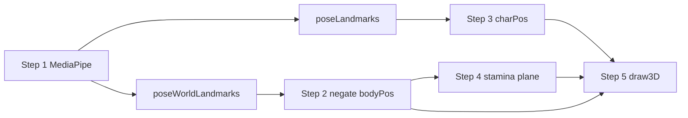

# Boxing demo — skeleton pipeline (right panel)

Source: `boxing_demo/boxing.html`, `boxing_demo/boxing.js`

One MediaPipe Pose call per frame produces **both** `poseLandmarks` (2D image) and `poseWorldLandmarks` (3D metres). The demo uses them for different jobs.

## Data streams

| Stream | Coordinates | Typical use in this demo |
|--------|-------------|-------------------------|
| **poseLandmarks** | `x,y` 0–1 in image; `z` relative | `charPos`, left-panel swings, debug |
| **poseWorldLandmarks** | `x,y,z` metres; hip-centred | Input to `worldLmToBodyPos` |
| **Negated bodyPos** | `(-x, -y, -z)` per joint | 3D skeleton, stamina depths, plane cross |

Reading image + world does **not** run Pose twice — both are in the same `onResults` object.

## Which step uses which stream?

| Step / feature | poseLandmarks | poseWorldLandmarks | Negated bodyPos | Notes |
|----------------|---------------|--------------------|-----------------|-------|
| **1 · MediaPipe** | outputs | outputs | — | One inference / frame |
| **2 · worldLmToBodyPos** | — | input | output | Right-panel skeleton space |
| **3 · charPos** | hip mid X + shoulder width | — | — | 12-frame standing baseline |
| **4 · stamina / plane** | — | via bodyPos | `computeBodySpaceDepths` | Limb crosses plane → punch/kick |
| **5 · draw3D** | — | — | bodyPos + charPos offset | Project joints to pixels |
| Left cam overlay | wrists/ankles hist | debug only | debug only | 2D video overlay |



---

## Step 1 — MediaPipe Pose

```js
mpPose.send({ image: video });
// onResults(results):
liveLm      = results.poseLandmarks;
liveWorldLm = results.poseWorldLandmarks;
```

| Output | Meaning |
|--------|---------|
| `poseLandmarks` | Normalized 2D pose in the camera image |
| `poseWorldLandmarks` | 3D pose in metres (hip-centred frame) |

---

## Step 2 — `worldLmToBodyPos` (negate → bodyPos)

**Input:** `poseWorldLandmarks` only  
**Output:** `bodyPos` map — joint index → `{ x, y, z }` in metres

Not IK/FK solving — copy landmarks into game space and mirror for the selfie view:

```js
pos[100] = { x: 0, y: 0, z: 0 };                    // synthetic pelvis
pos[101] = { x: -(w[11].x+w[12].x)/2, ... };        // mid-shoulder
pos[i]   = { x: -p.x, y: -p.y, z: -p.z };           // i in 0,11–16,23–28
```

### Example: world → negated body (metres)

| Joint | poseWorldLandmarks | bodyPos (negated) |
|-------|--------------------|-------------------|
| L shoulder [11] | (-0.20, -0.25, 0) | (0.20, 0.25, 0) |
| L wrist [15] | (0.26, -0.72, -0.35) | (-0.26, 0.72, 0.35) |
| Pelvis [100] | — | (0, 0, 0) |

### FK_BONES (connectivity only)

| Bone | Parent | Child |
|------|--------|-------|
| spine | 100 (pelvis) | 101 (mid-shoulder) |
| neck | 101 | 0 (head) |
| l_uarm | 11 | 13 |
| l_farm | 13 | 15 |
| r_uarm | 12 | 14 |
| r_farm | 14 | 16 |
| l_leg chain | 100→23→25→27 | — |
| r_leg chain | 100→24→26→28 | — |

---

## Step 3 — `charPos` (poseLandmarks only)

Does **not** modify `bodyPos`. Calibrated over **12** standing frames (`DEPTH_BASELINE_FRAMES`).

### Baseline (standing “zero”)

| Field | What it stores | How |
|-------|----------------|-----|
| `baseline.hipImgX` | Average hip mid **X** in image | `(lm[23].x + lm[24].x) / 2` over 12 frames |
| `baseline.refShW` | Average **shoulder width** in image | `abs(lm[11].x - lm[12].x)` over 12 frames |

### Per-frame position

```js
imgMidX = (lm[23].x + lm[24].x) / 2
shW     = abs(lm[11].x - lm[12].x)

charPos.x = -(imgMidX - baseline.hipImgX) * 1.8
charPos.y = 0
charPos.z = (shW / baseline.refShW - 1) * 0.9
// then × posMultiplier, EMA CHAR_SMOOTH = 0.10
```

| Axis | Driver | Meaning |
|------|--------|---------|
| **x** | Hip mid X vs `hipImgX` | Left/right on screen (m) |
| **z** | Shoulder width vs `refShW` | Wider ≈ closer (+z); narrower ≈ back (−z) |
| **y** | — | Always 0 |

At calibrated pose: `charPos.x ≈ 0`, `charPos.z ≈ 0`.

**Caveat:** Turning sideways shrinks shoulder width and can look like stepping back.

---

## Step 4 — Stamina depths and plane cross

**Offensive actions** (punch / kick / charge) are detected when a limb’s **body-space depth** crosses a plane — not from dodge or guard logic in this doc.

### Depths (negated bodyPos)

```js
hipZ  = (L_hip.z + R_hip.z) / 2
body  = mid_shoulder.z - hipZ
lw    = L_wrist.z - hipZ
rw    = R_wrist.z - hipZ
la    = L_ankle.z - hipZ
ra    = R_ankle.z - hipZ
```

- First **12** frames → `depthBaseline` (standing average).
- Each frame: subtract baseline, then EMA (`DEPTH_SMOOTH = 0.4`) → `smoothedDepths`.

### Red wall position (draw + debug)

```js
planeBaseZ  = smoothedDepths.body
planeWorldZ = charPos.z + planeBaseZ + forwardPlaneOffset + wristBase
```

| Term | Source | Role |
|------|--------|------|
| `charPos.z` | poseLandmarks (shoulder width) | Whole-body shift on floor / radar |
| `planeBaseZ` | negated bodyPos | Torso vs hips for cross detection |
| `forwardPlaneOffset` | UI slider (default 0.18 m) | Plane ahead of body depth |
| `detectStaminaPlaneCross` | `smoothedDepths` | Fire when wrist/ankle crosses `body + offset` |

---

## Step 5 — `draw3D` (projection)

**Input:** `bodyPos` (negated joints) and smoothed `charPos`.

### World vs camera-relative

```js
function projectXYZ(wx, wy, wz) {
  const lx = wx - charPos.x;   // offset from fighter (horizontal)
  const lz = wz - charPos.z;   // offset from fighter (depth)
  // yaw (camTheta) on XZ → rx, rz
  // pitch (camPhi) mixes wy and rz → ry, rz2
  const scale = (W * 0.42 * 1.6) / (camDist + rz2 + 0.001);
  return {
    sx: W / 2 + rx * scale,
    sy: H * 0.44 - ry * scale,
    sz: rz2,
  };
}
```

| Call | Use |
|------|-----|
| `project(bp)` | Skeleton: `projectXYZ(bp.x + charPos.x, bp.y, bp.z + charPos.z)` — body stays centred on screen |
| `projectWorld(wp)` | Floor grid + red wall — fixed world coords; scrolls when `charPos` moves |

### Pipeline inside `projectXYZ`

1. **`lx`, `lz`** — point relative to fighter (orbit pivot).
2. **Yaw** `camTheta` — drag orbit left/right.
3. **Pitch** `camPhi` — drag orbit up/down.
4. **Perspective** — `scale ∝ 1 / (camDist + depth)` → screen `sx`, `sy`.

### Draw order (back → front)

1. Floor grid (`projectWorld`)
2. Red stamina plane at `planeWorldZ`
3. FK_BONES segments
4. Joints, head, radar dot, axis gizmo

---

## `onPoseResults` order (simplified)

| # | Code | poseLandmarks | poseWorldLandmarks | Negated |
|---|------|---------------|--------------------|---------|
| 1 | `liveLm` / `liveWorldLm` | read | read | — |
| 2 | `bodyPosRaw = worldLmToBodyPos(liveWorldLm)` | — | read | write |
| 3 | `pushHist` + swing vectors (wrists/ankles) | read | — | — |
| 4 | `computeStaminaDepths(bodyPosRaw)` | — | via bodyPos | read |
| 5 | `captureCharBaseline` / `computeCharPosition(lm)` | read | — | — |
| 6 | EMA `charPos.x` / `charPos.z` | — | — | — |
| 7 | `syncPlaneFromDepths` → `planeWorldZ` | `charPos.z` | depths | read |
| 8 | `detectStaminaPlaneCross` | — | — | via depths |
| 9 | `draw3D(bodyPos)` | — | — | read |
| 10 | Left panel: video + debug | read | debug | debug |

---

## Related constants (`boxing.js`)

| Name | Value | Role |
|------|-------|------|
| `DEPTH_BASELINE_FRAMES` | 12 | Standing calib for char + depth |
| `CHAR_IMG_X_SCALE` | 1.8 | m per unit hip-mid X offset |
| `forwardDepthFromRatio` scale | 0.9 | m per shoulder-width ratio |
| `CHAR_SMOOTH` | 0.10 | EMA on charPos (html) |
| `DEPTH_SMOOTH` | 0.40 | EMA on stamina depths (html) |
| `forwardPlaneOffset` | 0.18 m default | Plane ahead of body |
